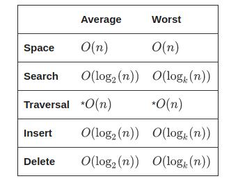

# Bitcoin

|Resources|
|---|
|[paper](https://bitcoin.org/bitcoin.pdf)|
|[bitcoin Stack exchange](https://bitcoin.stackexchange.com)|
|[blockexplorer](https://blockchain.info/)|
|[private testnet](https://github.com/freewil/bitcoin-testnet-box)|
|[bitcoind](https://en.bitcoin.it/wiki/Bitcoind)|
|[developer doc](https://bitcoin.org/en/developer-documentation)|


## Objective :
*visualizing bitcoin blockchain and discussing how exactly bitcoin uses blockchain*

## Glossary :

### Block
Blocks are files where data pertaining to the Bitcoin network is permanently recorded. A block records some or all of the most recent Bitcoin transactions that have not yet entered any prior blocks. Thus a block is like a page of a ledger or record book. Each time a block is ‘completed’, it gives way to the next block in the blockchain. A block is thus a permanent store of records which, once written, cannot be altered or removed.

#### Genesis Block
A genesis block is the first block of a block chain. Modern versions of Bitcoin number it as block 0, though very early versions counted it as block 1. The genesis block is almost always hardcoded into the software of the applications that utilize its block chain. It is a special case in that it does not reference a previous block, and for Bitcoin and almost all of its derivatives, it produces an unspendable subsidy.


### Merkle Tree
Merkle Tree is a tree in which every leaf node contains the hash of a data block and every non leaf node contains
a hash value which has been formed by combining the hashes of its children nodes.Typically, Merkle trees have a                 branching factor of 2, meaning that each node has up to 2 children.The root of the tree is called Merkle Root.
              
#### Need
In various distributed and peer-to-peer systems, data verification is very important. This is because the same                 data exists in multiple locations. So, if a piece of data is changed in one location, it's important that data is               changed everywhere. Data verification is used to make sure data is the same everywhere.

However, it is time consuming and computationally expensive to check the entirety of each file whenever a system               wants to verify data. So, this why Merkle trees are used. Basically, we want to limit the amount of data being                 sent over a network (like the Internet) as much as possible. So, instead of sending an entire file over the                     network, we just send a hash of the file to see if it matches.
              
#### Utility
The utility of Merkle trees are as follows:

1. Merkle Trees are tamper proof. Even if a single bit is changed in any of the leaf nodes or any non
   leaf node, the hash of its parent changes significantly proving that tampering had taken place.

2. If we want to validate a leaf node, we only need to consider one branch of the Merkle Root, the                                other can be ignored as it is not of any use here.
              
#### Use 
Currently, their main uses are in peer-to-peer networks such as Tor, Bitcoin, and Git.

#### PseudoCode
```
d1 = dhash(a)
d2 = dhash(b)
d3 = dhash(c)
d4 = dhash(c)            // a, b, c are 3. that's an odd number, so we take the c twice

d5 = dhash(d1 concat d2)
d6 = dhash(d3 concat d4)

d7 = dhash(d5 concat d6)
```
where
```
dhash(a) = sha256(sha256(a))
```
Note: markle tress generally uses sha256 for hashes and also RIPEMD-160 for smaller desired address like bitcoin address.

#### Complexity



#### Video References:
https://www.youtube.com/watch?v=VkWiTvPnTcY

https://www.youtube.com/watch?v=gUwXCt1qkBU

#### Documents: 
https://brilliant.org/wiki/merkle-tree/

Block (Bitcoin Block) https://www.investopedia.com/terms/b/block-bitcoin-block.asp

https://bitcoin.org/en/developer-guide


